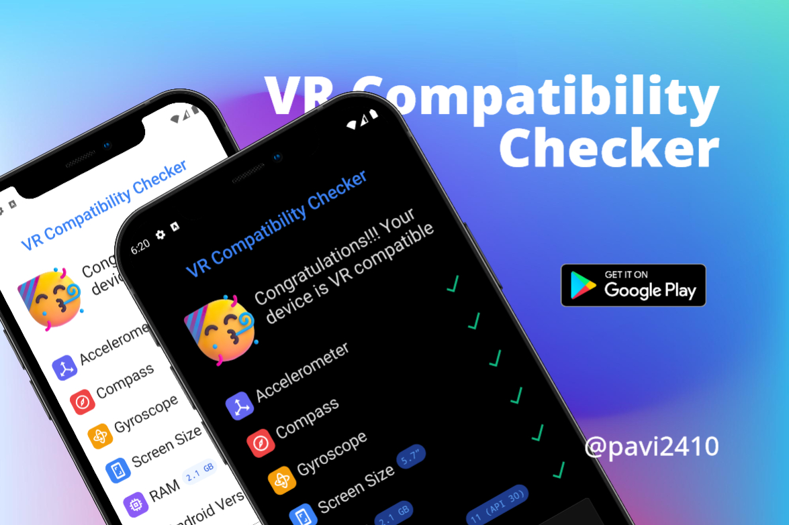
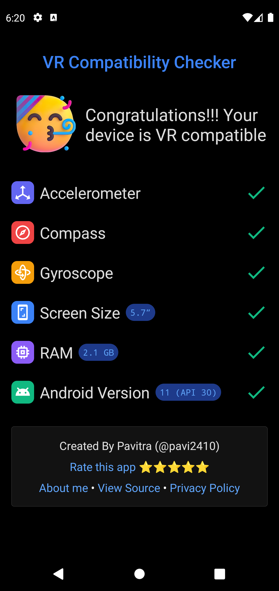
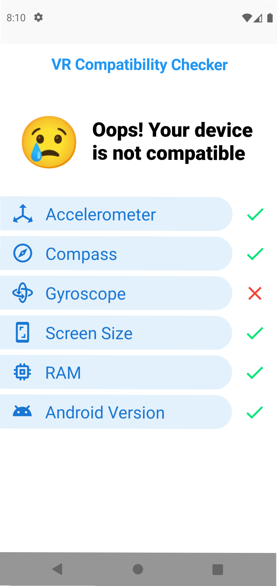

[][play store link]

[][play store link]

# VR Compatibility Checker — Fast & Accurate

 

Check if your device's ready for VR in a simple way. Use this app to find out whether your phone supports VR or not. Known to detect compatibility with Samsung Gear VR, HTC Vive, Oculus Rift, Google Cardboard and many other leading VR headsets. This app is used to check whether your phone supports gyroscope sensor or not, which is used for full compatibility of VR. Without a gyroscope sensor, you can use VR, but with limited functionality.

### Compatibility Criteria
This app checks for the following features:
- Accelerometer
- Gyroscope
- Compass
- Screen Size >= 5 inches
- RAM >= 2 GB
- Android version >= Android 5 Lollipop (API 21)

### Reasons to use this app
- Free & Open-Source
- Simple
- Lightweight (APK size < 1 MB)
- Compatible with Tablets too.

### Screenshots
Dark Theme | Light Theme
--- | ---
 | 

### Tech stack
- Android
- Kotlin
- Jetpack Compose

[play store link]: https://play.google.com/store/apps/details?id=appinventor.ai_pavitragolchha.VR
